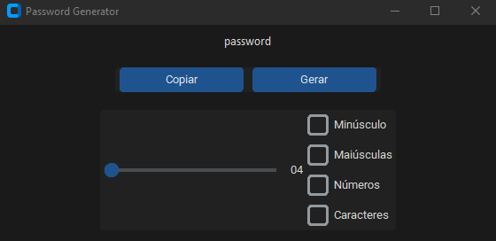

#  **Gerador de Senhas**

Um aplicativo simples de gerador de senhas, desenvolvido com **Python** e **Tkinter**.

**Funcionalidades**

-Gerar senhas aleatórias  
-Personalizar tamanho e tipo de senha (letras, números, símbolos)  
-Copiar senha para a área de transferência  
-Interface gráfica feita com Tkinter  

---

## **Tecnologias Utilizadas**

- **Python 3.10.12**  
- **Tkinter** 
- **Secrets** 

---

##  **Instalação**

1. Clone este repositório:  
   ```bash
   git clone https://github.com/FelippyGP/Password-Generator
   ```
2. Navegue até o diretório:  
   ```bash
   cd Password-Generator
   ```
3. Instale os requisitos:  
   ```bash
   pip install -r requirements.txt
   ```
4. Execute o programa:  
   ```bash
   python main.py
   ```

---

##  **Captura de Tela**



---

##  **Contribuindo**

Contribuições são bem-vindas! Siga os passos:

1. Faça um **fork** do projeto  
2. Crie uma nova branch: `git checkout -b minha-feature`  
3. Faça suas alterações e commit: `git commit -m 'Adicionar nova feature'`  
4. Envie para o repositório remoto: `git push origin minha-feature`  
5. Abra um **Pull Request**  

---

## **Autor**

- **Felippy Paiva**  
- [GitHub](https://github.com/FelippyGP)  
- [LinkedIn](https://www.linkedin.com/in/felippy-paiva-437b282b2/)  

---

## **Licença**

Este projeto está sob a licença **MIT**. Consulte o arquivo [LICENSE](LICENSE) para mais informações.

---


